# 设计模式的六大原则
#### 1.开闭原则（Open Close Principle）
开闭原则的意思是：对扩展开放，对修改关闭。在程序需要进行拓展的时候，不能去修改原有的代码，实现一个热插拔的效果。简言之，是为了使程序的扩展性好，易于维护和升级。想要达到这样的效果，我们需要使用接口和抽象类，后面的具体设计中我们会提到这点。

#### 2.里氏代换原则（Liskov Substitution Principle）
里氏代换原则是面向对象设计的基本原则之一。 里氏代换原则中说，任何基类可以出现的地方，子类一定可以出现。LSP 是继承复用的基石，只有当派生类可以替换掉基类，且软件单位的功能不受到影响时，基类才能真正被复用，而派生类也能够在基类的基础上增加新的行为。里氏代换原则是对开闭原则的补充。实现开闭原则的关键步骤就是抽象化，而基类与子类的继承关系就是抽象化的具体实现，所以里氏代换原则是对实现抽象化的具体步骤的规范。

#### 3.依赖倒转原则（Dependence Inversion Principle）
这个原则是开闭原则的基础，具体内容：针对接口编程，依赖于抽象而不依赖于具体。

#### 4.接口隔离原则（Interface Segregation Principle）
这个原则的意思是：使用多个隔离的接口，比使用单个接口要好。它还有另外一个意思是：降低类之间的耦合度。由此可见，其实设计模式就是从大型软件架构出发、便于升级和维护的软件设计思想，它强调降低依赖，降低耦合。

#### 5.迪米特法则，又称最少知道原则（Demeter Principle）
最少知道原则是指：一个实体应当尽量少地与其他实体之间发生相互作用，使得系统功能模块相对独立。

#### 6.合成复用原则（Composite Reuse Principle）
合成复用原则是指：尽量使用合成 / 聚合的方式，而不是使用继承。

# C++设计模式
设计模式可以化为三类：创建型模式、行为型模式、结构性模式
##  创建型模式:
* 针对创建对象模式设计，单例模式、建造者模式、工厂方法模式、抽象工厂模式、原型模式
    * 单例模式：确保只有一个实例，并提供一个对象安全访问接口
        * “饿汉模式”:一开始就创建对象,线程安全
        ```c++
        class Singleton {
        public:
        Single* Instance() { reutrn instance_; }
        private:
        Singleton() {}
        static Singleton instance_;
        };
        Singleton instance;//一开始就创建实例对象 
        ```

      * "懒汉模式":只有在调用到时候，再去创建，线程不安全，存在内存泄漏的问题
      ```
      class Singleton {
      public:
      Singleton& operator=(const Singleton&) = delete;
      Singleton(const Singleton &) = delete;
      Singleton& Instance() {
      static Singleton instance;
      return instance;
      }
      private:
      Singleton() {}
      };
      ```
      该种方式单例通过利用C++11种Magic static特性来为实例化中实现线程安全性(局部静态变量初始化有:变量的初始化在第一次声明的地方进行，初始化过程中发生异常视为未完成初始化，当前线程执行到初始化变量的地方时，如有其它线程正在执行该变量的初始化，则当前线程将会阻塞，直到初始化完成为止)
  * 建造者模式：将一个复杂对象的构建与其表示分离，使得同样的构建可以创建不同的表示
      * 适用场景：隔离复杂对象的创建和使用，相同的方法，不同的创建顺序，不同的事件结果
      * 多个部件可以装配到一个对象中，但产生的运行结果不相同
      * 产品类非常复杂或产品类因为调用顺序不同而产生不同作用
      * builder模式不适合创建差异性很大的产品类
  * 工厂方法模式：让子类决定创建的对象
  * 抽象工厂：创建多个产品族的产品对象
  * 原型模式：用原型实例指定创建对象的种类，并且通过拷贝这些原型来创建新的对象
      * 使用场景：当一个系统应该独立于他的产品创建、构成和表示时，需要用原型模式； 当实例化的类实在运行时刻指定时，如通过动态装载； 为了避免创建一个与产品类层次平行的工厂类层次时
      * 原型模式对比于拷贝构造的意义：原型模式生产的新对象可能是一个派生类，利用多态特性可以在获取Base*的情况下生成想要克隆的派生对象，而拷贝函数生成的对象只能是类的本身。原型模式是描述一个通用方法，它不管是如何实现的，而拷贝构造则是描述了一个具体的实现方法
## 行为模型
* Adapter Pattern:
    * 意义：
        * 将类的接口转换为客户端所期望的那样，实现兼容性问题(类如各国电源标准不同，需要通过适配器来兼容适配);
        * 用一个新类包装一个现有的类；
        * 阻抗使得旧元件与新系统相匹配
    * 结构：
        * 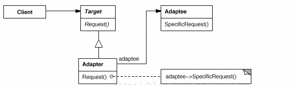
        * Target:客户直接调用类，该类中的Request不符合客户端使用要求
        * Adaptee：客户期待使用的特殊Request接口
        * Adapter：提供一个中间环节，继承了Request接口，并重新封装了Adaptee的SpecificRequest
* Bridge Pattern：
    * 意义：将抽象和实现分离解耦合，两者可以独立变化；在继承中发布接口，并在其继承中下沉实现
    * 结构：
        * 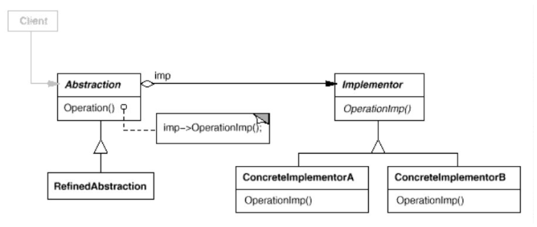
        * Abstraction:抽象类,维护一个指向实现类（Implementor）类型的对象的引用
        * Refined Abstraction: 扩展抽象类定义的接口
        * Implementor:实现类定义接口
        * ConcreteImplmentorA/B:具体Implementor的实现类
    * 优劣：
        * 将可能变化的部分单独封装起来，使得变化产生的影响最小，不用编译不必要的第代码
        * 抽象部分和实现部分可以单独的变动，并且每一部分的扩充都不会破坏桥梁模式搭起来架子
        * 实现细节对客户透明
    * 适用：类的实现由多种因素组合决定，不希望抽象和实现有固定的绑定关系，这时可以选着将类的抽象以及实现通过其子类加以扩充

* Composite Pattern：
    * 意义：组合模式将对象组合成树形结构表示整体-部分的结构，Composite允许客户端对单个对象和组合对象具有一致性。模糊了简单元素和复杂元素的概念，客户程序可以像处理简单元素一样来处理复杂元素
    * Compostite对象结构:
        * 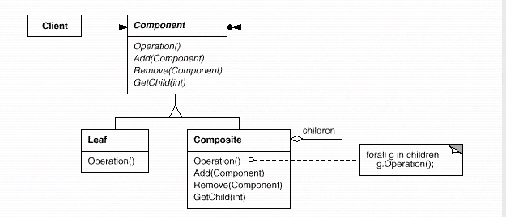
        * Component: 为组合中的对象声明接口； 在适当的情况下，实现所有类共有接口的缺省行为； 声明一个接口用于访问和管理Component的子组件
        * Leaf:在组合中表示叶节点对象，无子节点；在组合中定义图元对象的行为
        * Composite：定义有子部件的行为；实现与子部件相关的操作
        * Client：通过Compment接口操纵组合部件的对象

    * 组合模式有两种形式：透明模式和安全模式。透明模式在客户端看来，叶子节点类和合成类是一致的，只不过叶子节点类提供的子类管理方法(如add、remove等) 无实质意义，而安全模式刚好相反，叶子节点类没有合成类的子类管理方法，客户端来看，两者有不同接口，显得不透明
    * 使用场景： 表示对象的"部分-整体"的层次结构；希望用户忽略组合对象与单个对象的不同

* Decorator Pattern:
    * 意义: 
        * 动态地为对象附加额外的职责，相比生成子类方式，装饰器为扩展功能提供了一种更灵活的方式
        * 通过递归包装核心对象来装饰客户端指定的核心对象
    * 结构：
        * 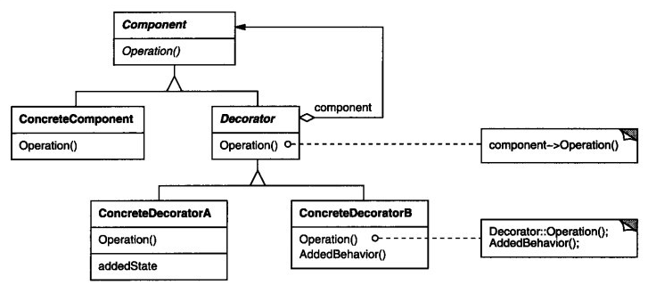
        * Component:抽象组件定义一个对象接口，使得装饰对象能动态加入到组件中。
        * ConcreteComponent:定义一个具体能附加职责的类。
        * Decorator:抽象装饰器，维持组件对象的一个引用，并定义与组件接口一致的接口。
        * ConcreteDecorator:具体装饰器,添加职责给组件。
    * 适用性：
        * 在不影响其他对象的情况下，以动态透明的方式给单个对象添加职责
        * 处理能收回的职责。
        * 当不能通过子类来扩充时。有时候一大堆独立的扩充是可能的，但将激增子类来支持每种扩充间的组合。或者一个类的定义可能被隐藏或不能用于生成子类

* Facade Pattern：
    * 意义：
        * 为子系统提供一组统一的接口，Facade定义了一个更高级的接口，使子系统更易使用。
        * 用更简单的接口包装一个复杂的子系统，一个常见的设计目的是使子系统捡到通信和相互依赖关系达到最小
    * 结构
        * 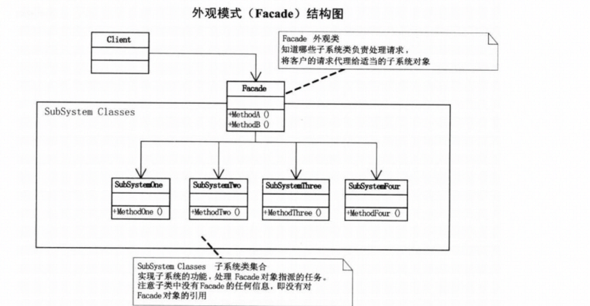
        * Facade:外观角色，客户端可以调用他的方法，其支持所有底层类的对象，并且包含底层类中所有的方法
        * SubSystem：子系统，相当于多个类的集合
        * Client：客户端，直接使用Facade接口提供的方法
    * 适用性：
        * 当为一个复杂子系统提供一个简单接口时
        * 客户程序与抽象类的实现部分之间存在很大的依赖性
        * 当需要构建一个层次结构的子系统时，适用Facade模式定义子系统中每层入口点，通过facade进行通讯
    * Note:设计应用场景，这个要分三个阶段来说:
        * 在设计初期阶段，应该要有意识的将不同的两个层分离，比如经典的三层架构，就需要考虑在数据访问层和业务逻辑层、业务逻辑层和表示层的层与层之间建立一个外观Facade，这个可以为复杂的子系统提供一个简单的接口，降低耦合。
        * 其次，在开发阶段，子系统往往因为不断的重构演化而变得越来越复杂，大多数的模式使用时也会产生一些很多的小类，增加外观Facade可以提供一个简单的接口，减少他们之间的依赖。
        * 第三，在维护一个遗留的大型系统时，可能这个系统已经非常难以维护和扩展了，但因为它包含非常重要的功能，新的需求开发必须依赖它。你可以为新系统开发一个外观Facade类，来提供设计粗糙或高度复杂的遗留代码的比较清晰接口，让新系统与Facade对象交互，Facade与遗留代码交互所有复杂的工作。
* Flyweight Pattern：
    * 意义：
        * 使用共享来有效地支持大量细粒度对象
        * 图形界面战略，以取代沉重的小部件
    * 结构
        * 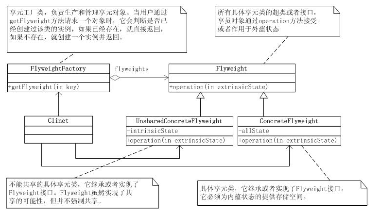
        * Flyweight：抽象享元类，声明了具体享元类公共的方法，向外界提供享元对象的内部数据(内部状态），同时也可以通过这些方法来设置外部数据(外部状态）
        * ConcreteFlyweight:具体享元类，实现抽象享元类，通常结合单例模式来设计具体享元类，为每个具体的享元类提供唯一对象
        * UnsharedFlyweight: 非共享具体享元类，不能被共享子类
        * FlyweightFactory：享元工厂类，结合工厂模式用于创建并管理享元对象
    * 概述: Flyweight模式中，最重要的是将对象分解成intrinsic(在享元对象内部不随环境变化)和extrinsic(随环境变化)两部分；在Flyweight中，通常修改的是外部状态属性，而内部状态属性一般都是用于参考或计算时引用
    * 优缺点：可以极大减少内存中对象的数量，使得相同或相似对象在内存中只保存一份，享元模式的外部状态相对独立，不会影响到内部状态， 从而使得享元对象可以在不同的环境中共享。 享元模式使得系统变得复杂，需要分离出内外部状态，使得程序程序逻辑复杂化；为使对象可以共享，享元模式需要将相应对象的部分状态外部化，而读取外部状态使得运行时间变长
    * 使用场景：
        * 一个系统有大量相同或者相似的对象，造成内存大量消耗
        * 对象的大部分状态都可以外部化，可以将这些外部状态传入对象中
        * 在使用享元模式时需要维护一个存储享元对象的享元池，而这需要耗费一定的系统资源，因此应当在需要多次重复使用享元对象时才值得使用享元模式
* private class data :私有类数据模式
    * 意义：    
        * 控制对类的属性的更改
        * 将数据与使用它的方法分离
        * 封装类的初始化数据
        * 提供新类型的final-final后置构造函数
    * 结构：
        * 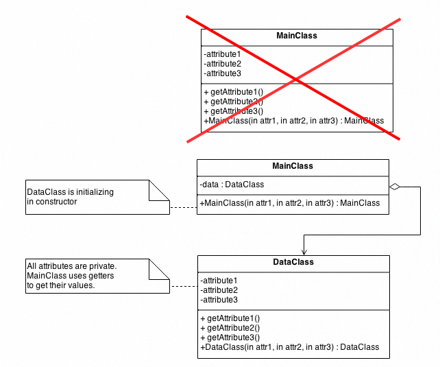
        * MainClass：根据构造函数列表构造DataClass类的实例
        * DataClass：封装数据
    * 适用场景：
        * 类的初始化数据是一次性的不可修改的数据
        * 需要控制对类的初始化数据的更改
        * 预防对初始化数据的不必要的更改
* Proxy Pattern：代理模式
    * 意义：
        * 为另一个对象提供一个代理或占位符来控制对它的访问
        * 适用额外的间接方式来支持分布式、智能访问
        * 添加包装器和委托，以保证真正的组件不受其他复杂性影响
    * 结构：
        * 
        * Subject:声明了RealSubject与Proxy的共同接口，定义了某些功能
        * RealSubject：通常执行具体的业务逻辑，Proxy控制对他的访问
        * Proxy：持有一个RealSubject引用(指针）,可以在需要时将请求转发给RealSubject，起到代理作用
        * Client：通过Proxy间接地与RealSubject进行交互
## 行为模式
* Chain of Responsibility Pattern:职责链模式
    * 意义：
        * 使多个对象都有机会处理请求，从而避免请求的发送者和接收者之间的耦合关系
        * 将接收对象链接起来，并沿着链接方向传递请求，直到一个对象响应请求
        * 使用包含许多可能的处理程序的单个处理管道启动和离开请求。
        * 一个具有递归遍历的面向对象链表
    * 概述：考虑员工要求加薪。公司的管理者一共有三级，总经理、总监、经理，如果一个员工要求加薪，应该向主管的经理申请，如果加薪的数量 在经理的职权内，那么经理可以直接批准，否则将申请上交给总监。总监的处理方式也一样，总经理可以处理所有请求。这就是典型的职责链模式，请求的处理形成 了一条链，直到有一个对象处理请求
    * 结构：
        * 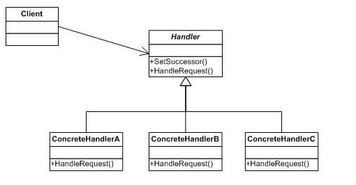
        * Handler:定义一个处理请求的接口，如果可以接口可以定义一个方法，以调用具体实现类的方法
        * ConcreteHandle:具体处理者，可以选择请求处理掉，或者下沉给下家 
    * 特点：
        * 职责链的特点是：当客户提交一个请求时，请求是沿链传递直至有一个Manager对象负责处理它。
        * 请求者不用管哪个对象来处理，反正该请求会被处理。它只需保持一个后继者即可。
        * 一个请求到链的最后可能也没有处理，所以一定要配置得当。
* Command Pattern:
    * 意义：
        * 将一个请求封装为一个对象，从而使你可用不同的请求对客户进行参数化；
        * 对请求排队或记录请求日志，以及支持可撤销的操作;
        * 在OOP中，一切都是对象，将请求封装成对象，符合OOP的设计思想，当将客户的单个请求封装成对象以后，我们就可以对这个请求存储更多的信息，使请求拥有更多的能力；
        * 命令模式同样能够把请求发送者和接收者解耦，使得命令发送者不用去关心请求将以何种方式被处理;
    * 结构：
        * 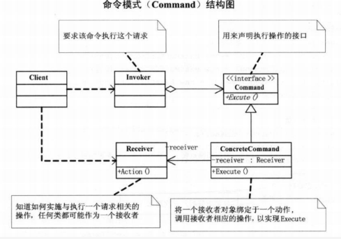
        * Command:声明执行操作的接口；
        * ConcreteCommand:将一个接收者对象与一个动作绑定在一起，之后调用接收者对应的操作，以实现execute来完成相应命令
        * Client：创建一个具体命令对象，但没有指定它的接收者
        * Invoker：要求该命令执行这个请求
        * Receiver:直到如何执行或操作一个请求，任何类都可以作为接收者
        * 以上对象是按照如下流程执行的：
            * Client创建一个ConcreteCommand命令对象，该对象绑定Receiver对象
            * Invoker对象存储该ConcreteCommand
            * 该Invoker通过调用Command的Execute来提交一个请求，如果该请求支持撤销，ConcreteCommand的Execute在执行前保存当前状态，用于取消该命令操作；
            * ConcreteCommand调用Receiver的一些操作以执行请求；
    * 优劣：命令模式的两个重要方面:接口分离(调用方与接收方隔离)、时间分离(存储准备就绪的处理请求，稍后再进行说明)。

* Interpreter Pattern:解释器模式
    * 意义:给予一种编程语言，为它的语法定义一种表现形式并包括一个解释器使用这个形式来解释语言中的语句
    * 结构：
        * 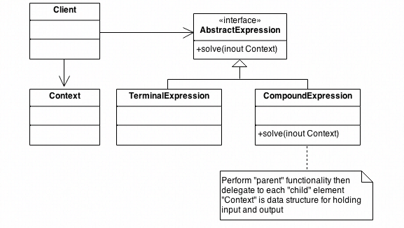
        * AbstractExpression:声明一个抽闲解释器操作，在抽象语法书中被所有节点所共有
        * TerminalExpression:末端表达式
            * 实现与在语法中与末端符号相关的解释操作
            * 在语句中每个末端符号都需要实例
        * NonteiminalExpression:非末端表达式
            * 在语法中每条规则都需要一个这样的类,\(R::=R_1R_2...R_n\)
            * 从\(R_1)到\(R_n)的每个符号都维护抽象表达式类型的实例变量
            * 实现在语法中非末端表达式的解释操作，解释器通常在\(R_1\)到\(R_n\)表示的变量中递归的自我调用
        * Context：场景类，包含解释器的全局信息
        * Client：
            * 建立表示语法定义的语言中的特殊语句的抽象语法树，这个抽象语法树由非末端表示类和末端表示类装配而成
            * 调用解释器操作
    * 适用场景：当一种语音需要解释，并且能够把语言内语句表示成一棵抽象的语法树时，使用解释器模式,最好应用在：
        * 语法是简单的，
        * 效率不是关键的考虑素。最高效的解释器往往不以直接解释解析树来实现，而是先把它们转换成另外种形式。比如，正则表达式通常被转换成状态机。但即使如此，这个转换器也可以由解析起模式来实现，所以这个模式还是比较实用的
    * 优劣：复杂的语法很难维护。解释器模式为语法中的每条规则定义至少一个类（以 BNF 定义的语法规则可能需要多个类）。因此包含许多规则的语法很难管理和维护。其他设计模式可以应用来消除这个问题（参考 Implementation）。但是当语法非常复杂时，比如解析器或编译生成起之类的其他技术更适合。
* Iterator Pattern:迭代器模式
    * 意义：
        * 提供一种方法按顺序访问聚合对象元素,而无需公开其底层表示;
        * 对于标准库抽象，使得分离集合类和算法成为可能;
    * 结构：
        * 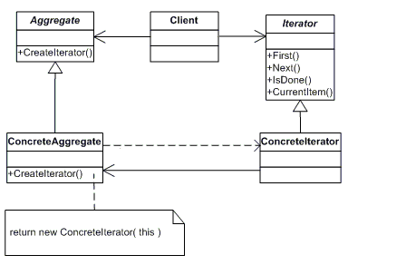
        * Iterator:迭代器角色，定义了访问和遍历元素的接口
        * ConcreteIterator: 具体实现迭代器接口
            * 实现迭代器接口。
            * 保存遍历聚合元素的当前位置
        * Aggregate:集合类，提供创建具体迭代器的接口
        * ConcreteAggregate：具体集合类，实现创建具体迭代器，与集合的结构相关
    * 适用场景：
        * 访问一个聚合对象的内容，但却不想暴露它的内部实现。
        * 为聚合对象支持所有遍历方法。
        * 为遍历不同的聚合结构提供一种统一的接口（即，支持多态迭代化）
    * 优劣：
        * 它支持以不同的方式遍历一个聚合对象
        * 迭代器简化了聚合类
        * 在同一个聚合上可以有多个遍历
        * 在迭代器模式中，增加新的聚合类和迭代器类都很方便，无须修改原有代码
        * 由于迭代器模式将存储数据和遍历数据的职责分离，增加新的聚合类需要对应增加新的迭代器类，类的个数成对增加，这在一定程度上增加了系统的复杂性

* Mediator Pattern:
    * 意义：
        * 定义一个对象来封装一组对象如何交互。中介者模式使各个对象不显示的互相引用，并让你独立的改变它们的交互，从而达到提高松耦合的效果
        * 设计一个中介者来解耦许多对等点
        * 将交互对等点多对多的关系提升到"完全对象状态"
    * 结构：
        * 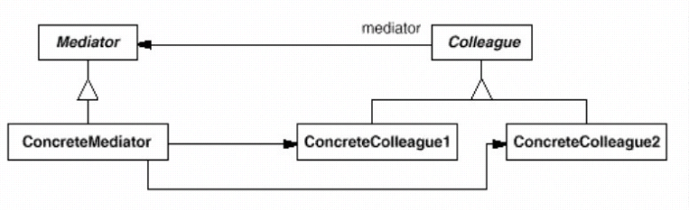
        * Mediator:抽象中介者，与同事（Colleague）对象交流定义一个接口。
        * ConcreteMediator:具体中介者
            * 实现与Colleague对象协作的合作行为
            * 知道和维护它的同事类。
        * Colleague:
            * 每个同事类知道它的中介者对象。
            * 每个同事类任何它应该时与它的中介者交流，否则就与其他同事类交流
        * 适用场景
            * 一组对象交流在很好定义的却复杂的方式上。导致的互相依赖性并没有好的组织而且难理解时;
            * 复用一个对象是困难的，因为它引用并交流与许多其他对象;
            * 分布在很多类中的一个行为需要被定制但不能进行太多子类化;
        * 优劣：中介者模式集中式控制。中介者模式以减少交互的复杂度而增加中介者的复杂度。因为一个中介者类封装了协议，它会变得比任何同事类都复杂。这会导致中介者类自身是个难维护的庞然大物
* Memento Pattern:备忘录模式
    * 意义：
        * 在不违反封装的情况下，捕获并外部化对象的内部状态，以便以后可以将对象返回到这种状态;
        * 封装了“检查点”功能的魔法cookie;
        * 促进撤消或回滚到完整的对象状态;
    * 结构：
        * 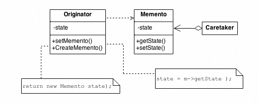
        * Originator:发起类，记录当前时刻的内部状态，提供创建备忘录和恢复备忘录数据的功能，实现其他业务功能他可以访问备忘录里的所有信息
        * Memento:备忘录，负责存储发起人的内部状态，在需要的时候提供这些内部状态发起人
        * Caretaker：管理者，对备忘录进行管理，提供保存与获取备忘录的功能，但其不能对备忘录的内存进行访问与修改
    * 适用场景：
        * 提供一个可回滚的操作
        * 需要保存/恢复数据的相关状态场景，譬如文字或图像的编辑器，撤销等动作功能
    * 优劣：
        * 可提供一种可恢复机制，方便用户操作历史回滚
        * 封装存档的信息，用户不需知道信息的保存细节
        * 因为需要保存信息，所有导致资源占用，有可能出现out of memory问题

* Null Object Pattern: 空对象模式
    * 意义：空对象的目的是通过提供一个可替换的替代方法来封装对象的不存在，该替代方法提供适当的默认不做任何事情的行为。简而言之，这是一个“一事无成”的设计,增加对象调用部分的稳定性。
    * 结构:
        * 
        * AbstractObject
            * 声明协作对象的接口。
            * 如果需要，可以实现默认行为。
        * RealObject:具体的协作对象类，提供有意义的行为。
        * NullObject:空对象类，继承自 AbstractObject，但接口实现不做任何事情。
        * Client:请求协作对象。
    * 适用场景：
        * 一个对象需要一个协作对象，但并无具体的协作对象;
        * 协作对象不需要做任何事情;
    * 优劣：
        * 减少了对对象是否为 Null 的判断。
        * 提供默认无任何具体行为的协作对象

* Observer Pattern:
    * 意义：
        * 在对象之间定义一个一对多的依赖关系，这样当一个对象改变状态时，它的所有依赖关系都会被通知并自动更新。
        * 将核心(或公共或引擎)组件封装在主题抽象中，将变量(或可选或用户界面)组件封装在观察者层次结构中。
    * 结构：
        * 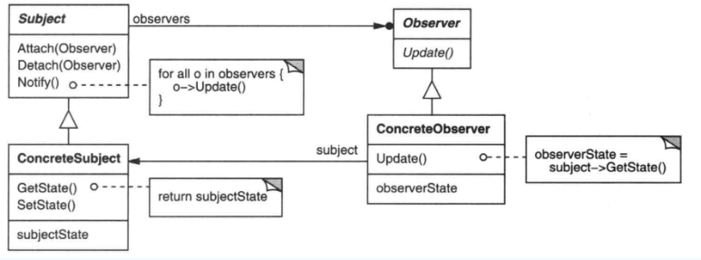
        * Subject：目标，知道它的观察者，提供注册和删除观察者对象的接口
        * Observer：观察者，为那些在目标发生改变时需获得通知的对象定义一个更新接口
        * ConcreteSubject：具体目标，存储对象状态，状态改变时，向各个观察者发出通知
        * ConcreteObserver：具体观察者，维护一个指向ConcreteSubject对象的引用，存储有关状态，实现更新接口update，使自身状态与目标的状态保持一致
    * 适用场景：
        * 当一个对象的改变需要同时改变其他对象，且不知道具体有多少对象有待改变时，应该考虑使用观察者模式；
        * 一个抽象模型有两个方面，其中一方面依赖于另一方面，这时可以用观察者模式将这两者封装在独立的对象中使它们各自独立地改变和复用
    * 优劣:
        * 目标和观察者之间松耦合
        * 支持广播通信：Subject发送的通知不需要指定它的接受者。通知被自动广播给所有已向该目标对象登记的有关对象。
        * 意外的更新：看似无害的操作可能会引起观察者错误的更新。
* State Pattern:
    * 意义：状态模式使得一个对象的行为依赖于状态的改变而改变
    * 结构：
        * 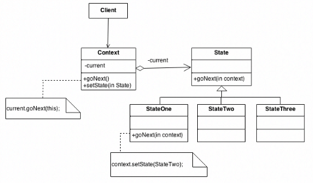
        * State:抽象状态类，定义一个接口以封装与Context的一个特定状态相关的行为；
        * ConcreteState:具体状态，每一个子类实现一个与Context的一个状态相关的行为;
        * Context:维护一个ConcreteState子类的实例，这个实例定义当前的状态;
    * 适用场景：
        * 一个对象的行为依赖于它的状态，并且再运行时它必须依赖于这个状态来改变它的行为;
        * 代码操作中拥有大量的依赖于对象状态的条件语句。这个状态通常被一个多多个枚举定值表示。时常，许多操作包含这同样的条件分支结构。状态模式将每个分支放入一个独立的类中。这让你可以把对象的状态当成每个自己负责的对象，而且这些对象能互相独立

* Strategy Pattern:
    * 意义：
        * 定义一系列算法，封装每个算法，并使它们可互换,策略允许算法独立于使用它的客户机而变化。
        * 在接口中捕获抽象，在派生类中隐藏实现细节。
    * 结构：
        * 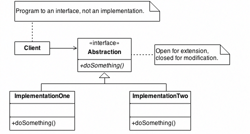
        * Strategy:抽象策略类，声明一个所有算法都支持的公共接口。场景(Context)利用这个接口来调用ConcreteStrategy实现的算法
        * ConcreteStrategy:具体策略类,实现具体的算法
        * Context:
            * 被具体策略对象配置;
            * 维持一个策略对象的引用;
            * 可能定义一个让策略对象获取它的数据的接口;
    * 适用场景：
        * 许多相关类仅仅是行为不同;
        * 需要使用一个算法的不同实现;
        * 算法使用了客户不应该知道的数据。策略模式可以避免暴露复杂的、与算法相关的数据结构;
        * 一个类定义了很多行为，而且这些行为在这个类里的操作以多个条件语句的形式出现。策略模式将相关的条件分支移入它们各自的 Strategy 类中以代替这些条件语句;
* Visitor Pattern:
    * 意义：
        * 表示一个作用于某对象结构中的各元素的操作。它使你可以在不改变各元素的类的前提下定义作用于这些元素的新操作
        * 用于恢复丢失的类型信息的经典技术。
        * 根据两个对象的类型做正确的事情。
    * 结构：
        * 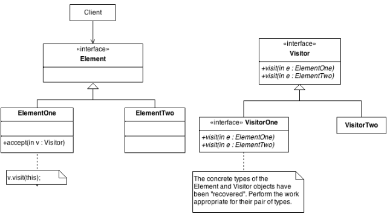
        * Visitor:抽象访问者，声明访问操作，形成所有的具体元素必须实现的接口
        * ConcreteVisitor:实现抽象访问者声明的接口， 也就是抽象访问者所声明的各个访问操作
        * Element:声明一个接收操作，接受一个访问者对象作为一个参量
        * ConcreteElement:实现了抽象元素所定义的操作
        * ObjectStructure:有如下的一些责任
            * 可以遍历结构中的所有元素；
            * 提供一个高层次的接口让访问者对象可以访问每一个元素；
            * 可以设计成一个复合对象或者一个聚集，如列（List）或集合（Set);
    * 适用场景：
        * 一个对象结构包含很多类对象
        * 需要对其中的对象进行很多不同的并且不相关的操作
        * 对象很少改变，经常需要对其上的操作进行修改或新增
    * 优劣：
        * 访问者模式使得增加新的操作变得很容易;
        * 访问者模式将有关的行为集中到一个访问者对象中，而不是分散到一个个的节点类中;
        * 增加新的元素很困难,每增加一个新的元素将在抽象访问者类（Visitor)中增加一个新的抽象操作，并在每个具体访问类（ConcreteVisitor）中增加相应的操作;
        * 破坏封装性，访问者的方法假定具体元素类（ConcreteElement）接口足够强大让访问者对它元素进行操作。因而，这个模式强迫你提供能访问元素内部状态的公开操作，从而导致破坏了它的封装性;

* Template Method模式：
    * 意义：
        * 在一个操作定义一个算法框架，将一些步骤延迟到客户端子类，模板方法允许子类在不改变算法结构情况下重新定义算法
        * 基类声明算法的“占位符”,派生类实现算法的占位符
    * 结构
        * 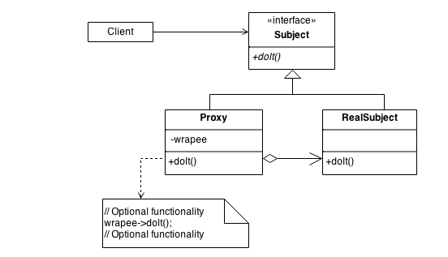
